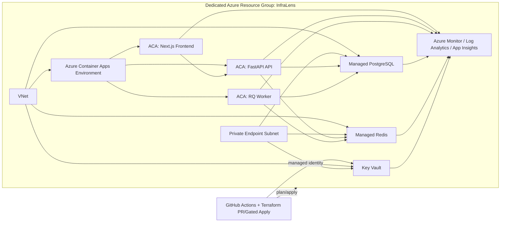

# Repository setup

Map source and document the delivery contract.

Mode: brownfield · Tier: T3 · Cloud: azure

## Components
- **Repository setup** (git): Map source and document the delivery contract.
- **Terraform backend and providers** (terraform): Remote state and provider pin so plans are repeatable.
- **Network (VPC/VNet, subnets, routing)** (virtual_network): Private data-plane subnets and routing for the new workload.
- **Compute platform** (container_apps): Host the API and worker on a managed container platform.
- **Database and backups** (postgresql): Managed PostgreSQL with backup retention.
- **Cache layer** (redis): Managed Redis for sessions and job coordination.
- **Secret management** (key_vault): Store app secrets in a managed vault, not env files.
- **IAM / identity least privilege** (managed_identity): Workload identity for the runtime, no long-lived keys in the repo.
- **Monitoring and alerting** (monitor): Logs, metrics, and an action group for incidents.
- **CI/CD with security scanning** (actions): Validate IaC and application tests on every push.
- **Integration tests** (pytest): Smoke tests that prove the generated contract still holds.

## IaC strategy
Terraform via PR, init → validate → plan, Lead+ gated apply. Never silent apply.

## Security
- Private data-plane subnets; no public PostgreSQL or Redis.
- Secrets in a managed vault, never committed env files.
- Workload identity instead of static cloud keys.

## Cost
- Prefer Azure Container Apps over Kubernetes until multi-team cluster ops are justified.
- Basic Redis and burstable Postgres for moderate traffic; review after first month.

## Context

